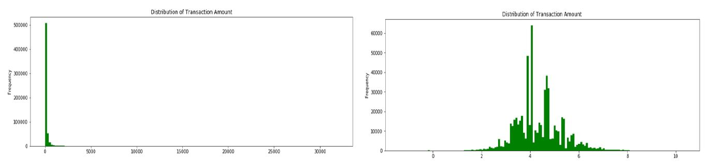

# Credit Card Fraud Detection

1000$ has been deducted from your AC xxxx1234. This message is enough to send most people panic mode! if the transaction is not made by them. In this project, I used data mining approach to solve the problem of hoax transaction by detecting whether it is fraudulent and to forbid it. 

### <ins>Table of contents</ins>:
  - [ Introduction ](#intro)
  - [ Data Description & EDA ](#desc)
  - [ Modeling & Results ](#res)
  - [ Conclusion ](#con)
  

### Introduction:
A staggering $24.26 Billion was lost in 2018 due to payment card fraud worldwide and United States still leads the world as the most card fraud prone country with 38.6 % of reported card fraud losses in 2018. This is a huge problem because it costs consumers and financial company billions of dollars annually, and fraudsters continuously try to find new rules and tactics to commit illegal actions. What makes it even more interesting is that one may not be even aware of fraud even if they are victimized. Plenty of steps have taken to address the issue but with less efficacy because of the lack of predictive model’s tendency to perform well with an unseen pattern. It is still a major issue in datamining techniques, but it performs better than the former but is less widely used.

|  | 
|:--:| 

This essentially needs to be reduced with constant innovations and in this project, I evaluated in detail random forests, support vector machines, logistic regression, light gradient boosting and extreme gradient boosting algorithms as an attempt to detect the fraudulent transactions better. Though the data mining techniques are in profuse use in many fields, little have been their usage in card detection. But, many papers in early 1990’s have used neural networks and to some extent Markov models. Their study was focused on impact of aggregating transaction level data of fraudulent prediction. The reason  neural networks are not tried is because they are prone to get overfit and may get struck in a local minima or saddle point. Also, the data mining models gives flexible optimization approach. Ensemble methods were preferred because they have very good generalization performance. Many statistical methods like logistic regression, nearest neighbor, Bayes classifier have been used to develop models and with evolution of AI and machine learning, the other advanced techniques were also used and compared with the earlier mentioned models. 

### Data Description:

The dataset is obtained from Vesta corporation via Kaggle competition. The training dataset is of the shape 590540*434 after merging the train identity and train transaction datasets. The two datasets have Transaction Id’s as common. The Train transaction has many important features like Time delta which is the transaction timeline from a given reference. The data feature isFraud is the response variable which is a binary feature. It also has Product codes which haven’t been revealed.

The Transaction amount is given in USD and it has a fair distribution only after transforming it which can be seen in the plot below.

|  | 
|:--:| 